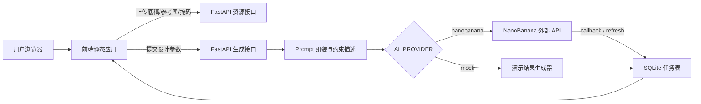

# 生成交互式的家装智能设计系统技术实现路线

## 1. 设计定位

本系统面向本科毕设演示与论文落地，核心目标是构建一套可运行的 B/S 架构家装智能设计系统。系统不在本地训练或部署生成模型，而是由后端统一封装外部图像生成 API，实现“设计底稿 + 风格参考 + 文本需求 + 局部掩码”的多模态交互式生成闭环。

结合文献综述和开题报告，系统重点解决三个问题：

1. 从草图、线稿、平面照片到家装效果图的快速可视化。
2. 在生成过程中保持墙体、门窗、透视和主要家具位置等空间约束。
3. 支持用户通过风格、色彩、材质、文化元素、局部掩码进行多轮交互修改。

## 2. 文献到工程模块的对应关系

| 文献/技术方向 | 论文中的作用 | 本系统中的工程落点 |
| --- | --- | --- |
| Pix2pix / cGAN 图像转译 | 解释草图到效果图的端到端映射思路 | 不本地训练模型，作为“结构底稿转译层”的理论依据，由图像生成 API 的 image-to-image 能力替代 |
| Latent Diffusion / ControlNet | 说明高质量图像生成和条件控制 | 通过后端 prompt 组装强调结构保持、风格迁移、局部编辑 |
| NanoBanana / 多模态大模型 | 作为高保真渲染和空间推理核心 | 后端 NanoBananaClient 统一调用外部 API，支持异步提交、回调和轮询 |
| AIGC UI / 包装设计应用研究 | 说明 AIGC 对设计流程提效 | 前端提供风格参数、参考图、结果预览和方案记录 |
| AI+ 家居定制设计系统 | 说明用户偏好匹配与定制交互 | 通过空间类型、预算、色彩、材质、文化元素等字段构造用户画像 |
| MR/Inpainting 室内翻新研究 | 说明局部翻新、局部重绘价值 | 前端 Canvas 绘制 mask，后端将 mask 纳入生成请求 |

## 3. 总体架构



## 4. 前端实现路线

前端位于 `frontend/`，使用 Vue 3 + Element Plus 组件库实现。当前版本通过 CDN 引入 Vue 与 Element Plus，避免 npm 构建步骤导致演示环境不稳定；FastAPI 仍可直接托管前端静态文件。主要页面就是可操作的设计工作台：

- 多模态输入：上传设计底稿、输入底稿 URL、上传风格参考图、输入参考图 URL。
- 参数化定制：空间类型、设计风格、色彩偏好、材质偏好、预算等级、文化元素。
- 局部重绘：使用 Canvas 绘制 mask，提交时自动上传为图片资源。
- 异步结果：提交后轮询任务状态，显示生成图，保留方案记录。
- 单服务运行：由 FastAPI 直接托管，访问 `http://127.0.0.1:8000` 即可使用。

## 5. 后端实现路线

后端位于 `backend/`，使用 FastAPI + SQLite：

- `POST /api/v1/assets/upload`：上传底稿、参考图、mask 图片，返回可访问 URL。
- `POST /api/v1/design/submit`：提交生成任务，自动组装面向家装设计的约束 prompt。
- `GET /api/v1/tasks/{task_id}`：查询任务状态和结果。
- `POST /api/v1/tasks/{task_id}/refresh`：主动轮询 NanoBanana 任务结果。
- `POST /api/v1/nanobanana/callback`：接收 NanoBanana 回调。
- `GET /api/v1/design/presets`：返回前端下拉选项。
- `GET /api/v1/tasks`：返回最近方案记录。

后端保留两种运行方式：

- `AI_PROVIDER=mock`：无需 API Key，用于答辩演示系统闭环。
- `AI_PROVIDER=nanobanana`：调用真实外部 API，不在本地部署模型。
- `AI_PROVIDER=auto`：有 `NANOBANANA_API_KEY` 时调用真实 API，否则使用 mock。

## 6. 真实 API 调用注意事项

如果使用本地上传图片调用 NanoBanana，外部 API 需要能访问这些图片 URL。因此真实生成时应配置：

```env
AI_PROVIDER=nanobanana
NANOBANANA_API_KEY=你的APIKey
PUBLIC_BASE_URL=https://你的公网隧道地址
```

开发阶段可以用 ngrok、cpolar 等工具把 `http://127.0.0.1:8000` 暴露为公网地址，并把公网地址写入 `PUBLIC_BASE_URL`。如果只用网络图片 URL，可以不经过本地上传。

## 7. 数据与任务流程

1. 用户上传底稿、参考图，或直接输入图片 URL。
2. 用户选择空间、风格、色彩、材质、文化元素等参数。
3. 用户可在 Canvas 上绘制局部重绘区域。
4. 前端将图片 URL、mask URL、文本需求一起提交到后端。
5. 后端将表单参数转化为结构化 prompt，强调空间结构保持和风格迁移。
6. 后端调用外部 API 创建异步任务，并写入 SQLite。
7. 前端通过任务 ID 轮询状态，成功后展示结果图。

## 8. 论文可写的创新点落地

- 以“结构约束 + 风格参考 + 用户偏好”的组合输入替代单一文本生成，贴合家装设计的强约束场景。
- 使用异步任务、回调和主动刷新机制，解决外部生成 API 响应时间不稳定的问题。
- 通过 Canvas mask 实现局部重绘交互，使系统从单次生成扩展到可迭代修改。
- 将非遗或文化元素作为显式参数纳入 prompt，使文献中的文化符号重构有可演示入口。
- 使用 mock provider 保证无网络或无 API Key 时仍可完整展示系统流程。

## 9. 运行方式

```powershell
cd D:\_STUDY\大四\生成交互式的家装智能设计系统的设计与研发\codes\backend
.\start_backend.bat
```

启动后打开：

```text
http://127.0.0.1:8000
```

真实 API 模式前，先复制并修改配置：

```powershell
copy .env.example .env
```

## 10. 后续可扩展方向

- 增加用户登录和方案收藏分类。
- 将方案记录扩展为项目表、房间表和生成版本表。
- 接入对象存储，避免本地上传图片无法被外部 API 访问。
- 增加主观评分表和生成耗时统计，用于论文实验分析。
- 对同一底稿使用不同风格进行 A/B 对比，形成答辩展示样例。
