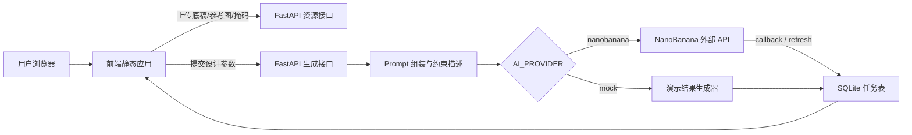

# 生成交互式的家装智能设计系统技术实现路线

## 1. 设计定位

本系统面向本科毕设演示与论文落地，核心目标是构建一套可运行的 B/S 架构家装智能设计系统。系统不在本地训练或部署生成模型，而是由后端统一封装外部图像生成 API，实现“设计底稿 + 风格参考 + 文本需求 + 局部掩码”的多模态交互式生成闭环。

结合文献综述和开题报告，系统重点解决三个问题：

1. 从草图、线稿、平面照片到家装效果图的快速可视化。
2. 在生成过程中保持墙体、门窗、透视和主要家具位置等空间约束。
3. 支持用户通过空间类型、风格、色彩、材质、文本需求、负向提示词和局部掩码进行多轮交互修改。

## 2. 文献到工程模块的对应关系

| 文献/技术方向 | 论文中的作用 | 本系统中的工程落点 |
| --- | --- | --- |
| Pix2pix / cGAN 图像转译 | 解释草图到效果图的端到端映射思路 | 不本地训练模型，作为“结构底稿转译层”的理论依据，由图像生成 API 的 image-to-image 能力替代 |
| Latent Diffusion / ControlNet | 说明高质量图像生成和条件控制 | 通过后端 prompt 组装强调结构保持、风格迁移、局部编辑 |
| NanoBanana / 多模态大模型 | 作为高保真渲染和空间推理核心 | 后端 NanoBananaClient 统一调用外部 API，支持异步提交、回调和轮询 |
| AIGC UI / 包装设计应用研究 | 说明 AIGC 对设计流程提效 | 前端提供风格参数、参考图、结果预览和方案记录 |
| AI+ 家居定制设计系统 | 说明用户偏好匹配与定制交互 | 通过空间类型、设计风格、色彩、材质和文本需求等字段构造用户偏好 |
| MR/Inpainting 室内翻新研究 | 说明局部翻新、局部重绘价值 | 前端 Canvas 绘制 mask，后端将 mask 纳入生成请求 |

## 3. 总体架构



## 4. 前端实现路线

前端位于 `frontend/`，使用 Vite + Vue 3 + Element Plus 组件库实现。开发阶段通过 Vite Dev Server 提供热更新和模块化开发能力，生产或答辩演示阶段通过 `npm run build` 生成 `frontend/dist`，再由 FastAPI 统一托管打包后的静态文件。主要页面就是可操作的设计工作台：

- 多模态输入：上传设计底稿、上传风格参考图，并在结果区展示底稿与生成结果对比。
- 参数化定制：空间类型、设计风格、色彩偏好、材质偏好、文本需求和排除项。
- 局部重绘：使用 Canvas 绘制 mask，提交时自动上传为图片资源。
- 异步结果：提交后轮询任务状态，显示生成图，保留方案记录。
- 单服务运行：由 FastAPI 直接托管，访问 `http://127.0.0.1:8000` 即可使用。

## 5. 后端实现路线

后端位于 `backend/`，使用 FastAPI + SQLite：

- `POST /api/v1/assets/upload`：上传底稿、参考图、mask 图片，返回可访问 URL。
- `POST /api/v1/design/submit`：提交生成任务，自动组装面向家装设计的约束 prompt。
- `GET /api/v1/tasks/{task_id}`：查询任务状态和结果。
- `POST /api/v1/tasks/{task_id}/refresh`：主动轮询 NanoBanana 任务结果。
- `POST /api/v1/nanobanana/callback`：接收 NanoBanana 回调。
- `GET /api/v1/design/presets`：返回前端下拉选项。
- `GET /api/v1/design/records`：返回用户历史方案记录。
- `GET /api/v1/favorites` / `POST /api/v1/favorites`：查询和保存收藏方案。
- `GET /api/v1/tasks`：返回最近生成任务。

后端保留两种运行方式：

- `AI_PROVIDER=mock`：无需 API Key，用于答辩演示系统闭环。
- `AI_PROVIDER=nanobanana`：调用真实外部 API，不在本地部署模型。
- `AI_PROVIDER=auto`：有 `NANOBANANA_API_KEY` 时调用真实 API，否则使用 mock。

## 6. 真实 API 调用注意事项

如果使用本地上传图片调用 NanoBanana，外部 API 需要能访问这些图片 URL。因此真实生成时应配置：

```env
AI_PROVIDER=nanobanana
NANOBANANA_API_KEY=你的APIKey
PUBLIC_BASE_URL=https://你的公网隧道地址
```

开发阶段可以用 ngrok、cpolar 等工具把 `http://127.0.0.1:8000` 暴露为公网地址，并把公网地址写入 `PUBLIC_BASE_URL`。当前项目也支持通过 SFTP 将本地上传图片转存到云服务器目录，再由 Nginx 暴露 `/uploads/` 公网路径，从而解决外部 API 无法访问本机图片的问题。

## 7. 数据与任务流程

1. 用户上传底稿、参考图。
2. 用户选择空间、风格、色彩、材质等参数，并填写设计需求或排除项。
3. 用户可在 Canvas 上绘制局部重绘区域。
4. 前端将图片 URL、mask URL、文本需求一起提交到后端。
5. 后端将表单参数转化为结构化 prompt，强调空间结构保持和风格迁移。
6. 后端调用外部 API 创建异步任务，并写入 SQLite。
7. 前端通过任务 ID 轮询状态，成功后展示结果图。

## 8. 论文可写的创新点落地

- 以“结构约束 + 风格参考 + 用户偏好”的组合输入替代单一文本生成，贴合家装设计的强约束场景。
- 使用异步任务、回调和主动刷新机制，解决外部生成 API 响应时间不稳定的问题。
- 通过 Canvas mask 实现局部重绘交互，使系统从单次生成扩展到可迭代修改。
- 将空间类型、风格、色彩、材质和文本需求结构化纳入 prompt，使用户偏好能够稳定转化为生成约束。
- 使用 mock provider 保证无网络或无 API Key 时仍可完整展示系统流程。

## 9. 运行方式

```powershell
cd D:\_STUDY\大四\生成交互式的家装智能设计系统的设计与研发\codes\backend
.\start_backend.bat
```

启动后打开：

```text
http://127.0.0.1:8000
```

真实 API 模式前，先复制并修改配置：

```powershell
copy .env.example .env
```

## 10. 前后端文件职责说明

本系统采用前后端分离但由 FastAPI 统一托管静态资源的实现方式。前端主要负责用户交互、图片预览、掩码绘制和结果展示；后端主要负责用户认证、任务提交、图片上传、外部 API 调用、任务状态维护和数据持久化。各文件职责如下。

### 10.1 前端文件

| 文件 | 主要作用 | 对应功能模块 |
| --- | --- | --- |
| `frontend/index.html` | Vite 前端入口 HTML，只保留 `#app` 挂载节点和 `src/main.js` 模块入口。页面主体不再直接写在 HTML 中，而是交给 Vue 单文件组件管理。 | 前端应用入口 |
| `frontend/src/main.js` | Vue 应用启动文件，导入 `App.vue`、Element Plus 组件库和全局样式，并将应用挂载到 `#app`。 | 应用初始化、组件库注册 |
| `frontend/src/App.vue` | 前端主容器组件，负责维护全局状态、调用后端接口、处理任务提交与轮询、管理历史记录和收藏方案，并将数据通过 props 和事件传递给各个业务子组件。 | 全局状态管理、业务流程编排 |
| `frontend/src/styles.css` | 前端全局样式文件，定义页面布局、左右工作区、上传卡片、风格预设高亮、结果图容器、历史详情、收藏列表、最近任务滚动区、预览弹窗和响应式布局等视觉样式。 | 页面视觉设计、布局适配、交互状态反馈 |
| `frontend/src/components/AuthPanel.vue` | 登录注册组件，负责展示登录/注册表单，并通过事件将认证提交动作交给父组件处理。 | 用户认证界面 |
| `frontend/src/components/AppHeader.vue` | 顶部导航组件，展示系统标题、当前用户和退出登录按钮。 | 顶部栏、用户状态展示 |
| `frontend/src/components/ControlPanel.vue` | 左侧设计控制组件，负责底稿/参考图上传入口、风格预设选择、设计参数表单、高级设置和局部掩码 Canvas 绘制。该组件向父组件暴露 `drawDraftToCanvas`、`clearMask`、`canvasToBlob` 等方法，用于生成流程中的图片和掩码处理。 | 素材输入、设计参数、局部重绘 |
| `frontend/src/components/ResultPanel.vue` | 右侧结果展示组件，负责生成结果预览、收藏/下载按钮、底稿与参考图预览、历史方案详情、收藏方案列表和最近任务列表。 | 结果展示、历史记录、收藏方案 |
| `frontend/src/components/ImageDialogs.vue` | 图片弹窗组件，负责普通图片查看弹窗和底稿/生成结果对比弹窗。 | 图片预览、对比查看 |
| `frontend/package.json` | 前端 npm 工程配置文件，声明 Vue、Vite、Element Plus 等依赖，并提供 `dev`、`build`、`preview` 等脚本。 | 前端依赖管理、工程脚本 |
| `frontend/vite.config.js` | Vite 配置文件，配置 Vue 插件、相对路径打包和开发环境接口代理，将 `/api`、`/healthz`、`/uploads` 转发到后端服务。 | 前端构建配置、开发代理 |
| `frontend/package-lock.json` | npm 依赖锁定文件，记录精确依赖版本，保证不同环境安装出的前端依赖一致。 | 依赖版本锁定 |
| `frontend/dist/` | Vite 构建输出目录，保存打包后的 HTML、CSS 和 JS 静态资源。后端检测到该目录后会优先将其挂载到 `/app/`。 | 生产静态资源 |
| `frontend/README.md` | 前端运行说明文档，记录开发启动、生产构建和后端托管方式。 | 前端维护说明 |

### 10.2 后端核心文件

| 文件 | 主要作用 | 对应功能模块 |
| --- | --- | --- |
| `backend/app/main.py` | 后端主入口文件，创建 FastAPI 应用并注册所有接口。该文件实现用户注册登录、静态页面托管、图片上传、远程服务器 SFTP 转存、设计任务提交、NanoBanana 回调、任务刷新、历史方案查询、收藏方案管理等核心流程，是后端控制层。 | API 路由、用户认证、上传服务、生成任务、回调处理 |
| `backend/app/models.py` | 数据模型定义文件，使用 Pydantic 定义前后端请求和响应结构，包括用户注册登录、生成请求、任务状态、设计记录、收藏方案、上传结果和 NanoBanana 回调数据等。 | 数据结构约束、接口入参与出参校验 |
| `backend/app/settings.py` | 系统配置文件，通过环境变量读取运行参数，包括 AI 服务商选择、NanoBanana API Key、公网基础地址、上传目录、SQLite 数据库路径、远程上传服务器地址、SFTP 用户和路径等。 | 配置管理、部署参数管理 |
| `backend/app/prompting.py` | 提示词组装文件，将用户选择的空间类型、设计风格、色彩、材质、文本需求、排除项和结构保持开关转换为面向家装设计的结构化英文 prompt。 | Prompt 工程、生成约束表达 |
| `backend/app/nanobanana_client.py` | NanoBanana 外部 API 客户端文件，封装 HTTP 请求逻辑，包括普通生成接口、Pro 生成接口和任务详情查询接口，使业务层不直接依赖底层 HTTP 调用细节。 | 第三方 AI API 封装 |
| `backend/app/mock_provider.py` | 演示模式结果生成文件，在没有 API Key 或网络不稳定时返回可用的模拟任务和示例结果，保证答辩演示时系统流程可以完整跑通。 | Mock 演示模式、容错演示 |
| `backend/app/tasks_store.py` | SQLite 数据访问文件，负责创建和维护用户表、会话表、任务表、设计记录表和收藏方案表，封装任务保存、结果更新、历史查询、收藏增删等数据库操作。 | 数据持久化、历史记录、收藏管理 |

### 10.3 后端辅助文件与运行文件

| 文件 | 主要作用 | 说明 |
| --- | --- | --- |
| `backend/requirements.txt` | Python 依赖清单，记录 FastAPI、Uvicorn、HTTPX、Pydantic、Paramiko 等后端运行所需依赖。 | 用于环境安装和复现实验环境 |
| `backend/.env.example` | 环境变量示例文件，说明 NanoBanana、公网地址、远程上传服务器、SFTP 转存目录等配置项。 | 可提交到仓库，供部署参考 |
| `backend/.env` | 本地真实配置文件，保存 API Key、服务器地址等敏感配置。 | 只用于本机运行，不应提交到 GitHub |
| `backend/start_backend.bat` | Windows 后端启动脚本，自动切换到后端目录、检查虚拟环境、释放 8000 端口并启动 Uvicorn 服务。 | 本地开发和答辩演示启动 |
| `backend/README.md` | 后端说明文档，记录系统启动方式、配置方式、API 列表和远程上传部署说明。 | 项目说明和部署说明 |
| `backend/scripts/call_generate.py` | 命令行测试脚本，可直接调用后端生成接口，用于不经过前端时验证接口和 NanoBanana 调用链路。 | 接口调试、后端测试 |
| `backend/tasks.db` | SQLite 运行时数据库文件，保存用户、任务、历史方案和收藏方案数据。 | 运行时数据，不属于核心源码 |
| `backend/uploads/` | 本地上传文件目录，保存底稿、参考图和 mask 图片的本地副本。真实生成时可以通过远程上传功能返回云服务器公网 URL。 | 运行时资源目录 |
| `backend/server.log` / `backend/server.err.log` | 服务运行日志文件，记录后端启动和错误信息。 | 调试辅助文件，不属于核心源码 |

### 10.4 根目录文件

| 文件 | 主要作用 | 说明 |
| --- | --- | --- |
| `start_fullstack.bat` | 项目根目录一键启动脚本，进入 `backend/` 并调用 `start_backend.bat`。由于前端由 FastAPI 静态托管，因此启动后端即可同时访问前端页面。 | 一键启动入口 |
| `TECHNICAL_ROUTE.md` | 技术实现路线文档，记录系统定位、技术选型、架构流程、前后端模块、数据流程、文件职责和后续扩展方向，可作为论文“系统设计与实现”章节的材料来源。 | 论文材料整理 |

从论文写作角度看，可以将上述文件进一步归纳为五个模块：前端交互模块、用户与方案管理模块、图片上传与公网访问模块、AI 生成任务模块、数据持久化模块。这样既能说明工程实现细节，也能避免论文按文件逐个堆砌而缺少系统结构。

## 11. 后续可扩展方向

- 增加方案收藏分类、项目归档和按房间维度管理。
- 将方案记录扩展为项目表、房间表和生成版本表。
- 接入对象存储，避免本地上传图片无法被外部 API 访问。
- 增加主观评分表和生成耗时统计，用于论文实验分析。
- 对同一底稿使用不同风格进行 A/B 对比，形成答辩展示样例。
